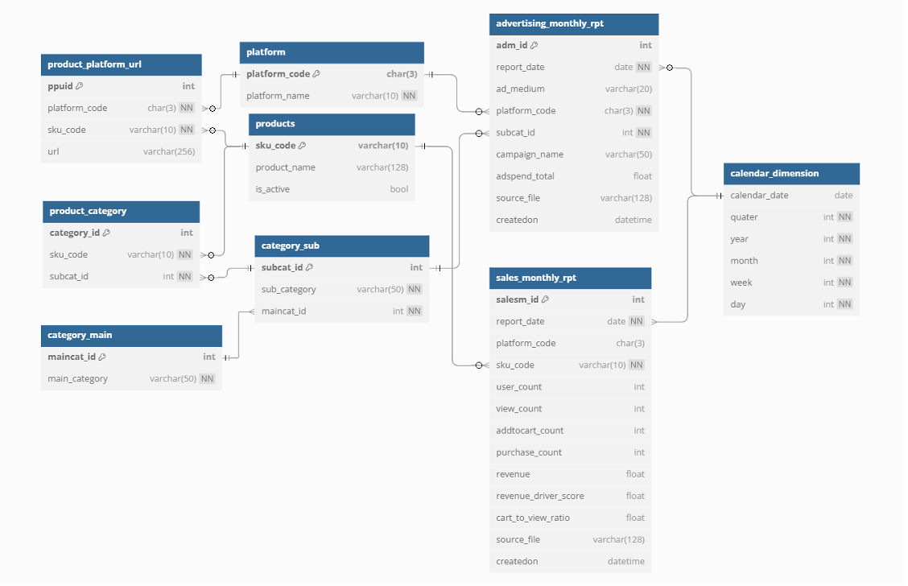

# 🏋️ Sole Fitness Business Analytics Project

This project was completed as part of the NUS Master of Technology in Enterprise Business Analytics programme.  
We collaborated with a Singapore-based e-commerce SME to integrate analytics by creating a unified data base, formulating metrics to diversify revenue and optimise advertising expenditure.

---

## 🎯 Project Highlights

- 📦 **Data Integration**: Designed a normalised **PostgreSQL** database consolidating website, Shopee, and Lazada sales data.
- 📊 **Dashboard Development**: Built **Power BI** dashboards to visualise sales trends, product performance, and business KPIs.
- 🧠 **Clustering Analysis**: Applied **K-Means** clustering to segment products and identify underperformers for revenue diversification.
- 📈 **Ad Spend Optimisation**: Created a **ROAS** (Return on Ad Spend) metric and used correlation analysis to uncover inefficiencies, enabling a **4% reduction in advertising costs**.

> 💡 *Note: As this project was conducted for a live business, datasets are confidential. However, the report and code provide sufficient context to understand the scope and solutions delivered.*

---

## 📁 Project Files

| File | Description |
|------|-------------|
| `01 - postgreSQL database.sql` | SQL script for creating the data warehouse schema. |
| `02 - sole-fitness-clustering.ipynb` | Python notebook for clustering analysis on product metrics. |
| `03 - sole-fitness-dashboards.pbix` | Power BI dashboard visualising multi-platform performance. |
| `04 - sole-fitness-project-report.pdf` | Final project report with full methodology, visuals, and recommendations. |

---

## 🧰 Tools & Technologies

| Category            | Tools Used                                      |
|---------------------|-------------------------------------------------|
| **Database**        | PostgreSQL                                      |
| **Programming**     | Python (`pandas`, `scikit-learn`, `matplotlib`) |
| **Visualisation**   | Power BI                                        |
| **Machine Learning**| K-Means Clustering                              |
| **ETL & Modelling** | SQL, Google Colab, Excel                        |

---

## 🧾 Report Overview

- Integrated sales and ad data from three major channels: website, Shopee and Lazada on unified postgreSQL database. 
- Formulated KPIs and custom metrics like Revenue Driver Score (RDS) and ROAS.
- Delivered PowerBI dashboard to visualise insights to reduce platform over-reliance and optimise advertisement ROI.
- Proposed analytical backed recommendations for Sole Fitness to diversify revenue streams and optimise advertisement expenditure. 

---

## 🖼️ Key Visuals

### 🗂️ Entity Relationship Diagram (ERD)

---

### 📊 Sales Trend Dashboard

---

### 📈 Revenue Driver Score Dashboard

---

### 💸 ROAS & Ad Spend Dashboard

---

🔗 [Back to Portfolio](https://torana1998.github.io/)

